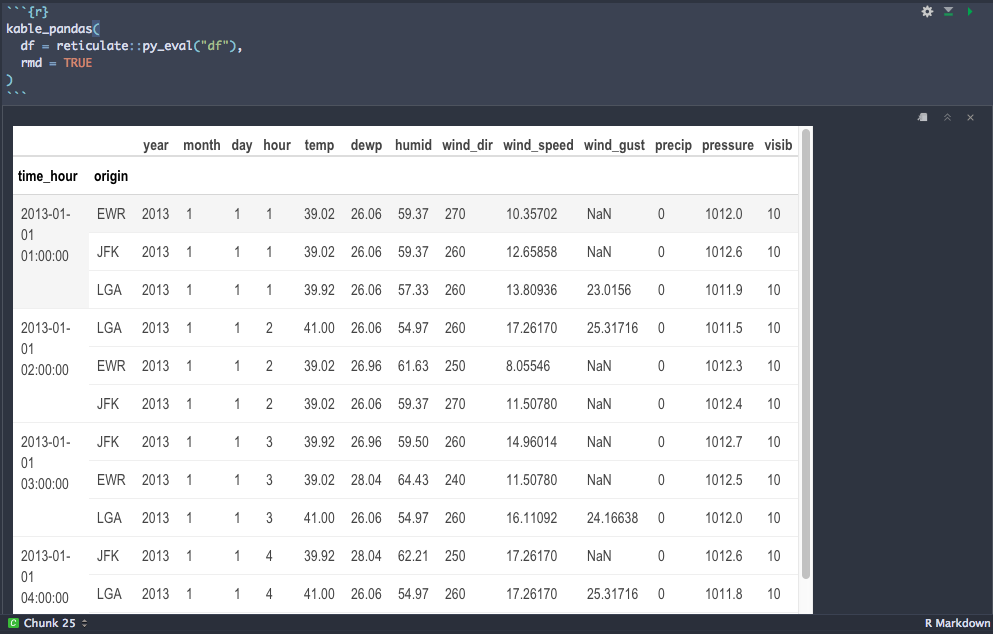

```{r setup, include = FALSE}
library(magrittr)
library(tidyverse)
library(reticulate)
library(emo)
library(nycflights13)
knitr::opts_chunk$set(warning = FALSE, message = FALSE)
# custom script with helper functions
source(here::here("kable_pandas.R"))
weather_data_path <- here::here("data", "weather.csv")
```

```{python echo = FALSE}
import pandas as pd
import numpy as np

arrays = [np.array(['bar', 'bar', 'baz', 'baz', 'foo', 'foo', 'qux', 'qux']),
        np.array(['one', 'two', 'one', 'two', 'one', 'two', 'one', 'two'])]
tuples = list(zip(*arrays))
index = pd.MultiIndex.from_tuples(tuples, names=['first', 'second'])
df_basic = pd.DataFrame(np.random.randn(8, 4), columns=['a','b','c','d'])
df_multi = pd.DataFrame(np.random.randn(8, 4), index = index, columns=['a','b','c','d'])
```

<base target="_top"/>

# But, why?

Ok, fair question. Well, one day I was building a lesson in Python and I just had it with how ugly the default pandas DataFrame output looked on rmarkdown. Here's an example of a dataframe using `pandas`:

```{python echo=FALSE, fig.align="center"}
df_multi
```

Looking at this, I thought to myself we have all these amazing R packages for RMarkdown to render pretty dataframes so why not use them? I know what you're thinking: "But, you can't do that since all these great R packages only accept R dataframes!" 

Yes, fair point. But, what if I made an R dataframe "look" like a Python dataframe so I can still use these packages?

<p align="center">
  
</p>

In this post, I talk about how I was able to use `{reticulate}` to mimic a Python `DataFrame`, and `{kableExtra}` together with `{formattable}` R packages to give some love to Python DataFrames rendering in RMarkdown documents. In the end, we will end up with something like this (hover over the rows!):

```{r echo=FALSE}
kable_pandas(
  df = reticulate::py_eval("df_multi")
)
```

Keep in mind, the solutions I present in this post are largely dirty hacks, but it is truly amazing how far you can go with these packages, so let's begin! I'll likely be brief, highlighting the crucial parts to making this work but if you want a closer look, all the data and images can be found [here](https://github.com/nischalshrestha/pandas-rmarkdown).

# What does a `pandas.DataFrame` look like? `r emo::ji("eyes")`

For a "good enough" visual representation of a Python `DataFrame` in `pandas`, I thought about some differences that need to be handled:

- 0-indexing
- Some data type formatting
- Visualizing Python's crazy `MultiIndex` data structure

Of course, there are probably plenty of other differences beyond these, but I decided to handle these for now. `r emo::ji("smile")`

I will use the raw `weather.csv` dataset from the `nycflights13` [package](https://github.com/hadley/nycflights13) to illustrate how Python dataframes look different when compared to R.

Here's the R dataframe:

```{r}
nycflights13::weather
```

Let's import Python libraries `pandas` and `numpy` as well as set up our `weather` dataframe called `df` in Python with US/Eastern timezone:

```{python}
import pandas as pd
import numpy as np
df = pd.read_csv(r.weather_data_path, parse_dates=['time_hour'])
df.time_hour = pd.to_datetime(df.time_hour.dt.tz_convert('US/Eastern'))
df
```

Ok, we can definitely see the 0-indexing difference in Python's output. We also see that R's dataframe output is a lot more informative on the column types. How about some more details on the columns?

R:

```{r}
glimpse(nycflights13::weather)
```

Python:

```{python}
df.info()
```

From above, we can see that the core data types are pretty much the same. I will show how `reticulate` will help us with those. But, we'll quickly come across an interesting difference in visual output with grouped dataframes. So, before we get to our table making fun, we need to briefly explain Python's `Index` and `MultiIndex`.

## Enter `Index` and `MultiIndex`

In `pandas`, there is a data structure called an `Index`, which you can kind of think of as the `key` column for your table. To me, the `Index` is one of the most confusing data structures, yet it is a core part of the `DataFrame` and `Series` data structures (similar to R `data.frame` and `vector`, respectively), and it allows us powerful indexing semantics. More on `Index` [here](https://pandas.pydata.org/pandas-docs/stable/reference/indexing.html).

This is all pretty vague, so let's run through an example with our `weather` dataset. What's the index of our dataframe `df`?

```{python}
df.index
```

It's a `RangeIndex`, which is very similar to how we normally index R dataframes using numbers.

But now, let's say we want to reshape our `weather` dataframe by time (`time_hour`) and then by airport (`origin`):

```{python}
df.set_index(['time_hour', 'origin'])
```

Ok, that looks a bit different! The `time_hour` and `origin` look like they belong together and are all the way to the left, and the rest of the actual columns are "raised". But, it's only when we sort the data by `time_hour`, that we actually see that our dataframe has been essentially grouped by these two columns:

```{python}
df.set_index(['time_hour', 'origin']).sort_values(by='time_hour')
```

In other words, this is no longer a regular dataframe but one that seems to have multiple `Index` levels into our table. To explain, let's set the new dataframe to `df` and print the index:

```{python}
# set index and return resulting DataFrame
df = df.set_index(['time_hour', 'origin']).sort_values(by='time_hour')
# index is now a MultiIndex
df.index
```

As you can see, we now have a `MultiIndex` for `df` where the names of the 2 levels are `time_hour` and `origin`. 

**The problem:** We don't really have a direct equivalent to `Index` or `MultiIndex` in R. We subset R dataframe rows using numerical indices (e.g. `df[1:2]`) or by `character` via `row.names` (e.g. `mtcars['Volvo 142E', ]`). However, the `Index` and `MultiIndex` in Python is a lot more complex because it also allows "heirarchical indexing", meaning we can have many levels of subsetting rows (and columns).

For example, reshaping our dataframe `df` now allows us to perform complex queries using just labels. Here, we index into rows for January for JFK using `loc`:

```{python}
df.loc[('January, 2013', 'JFK'), ]
```

Neat! Note how there are two levels of `Index` here, which forms a `MultiIndex`. Why do we need this? Well, because we now have a heirarchy of `Index` levels, we can use a subset operation via `loc` on a dataframe `df` to subset rows which corresponds to `'January, 2013'` on the `time_hour` level, then the `'JFK'` on the `origin` level. This is quite powerful, and is the basis of `pandas.group_by` operations.

Now, let's see how we can use `reticulate`, `kableExtra`, and `formattable` to make an R `data.frame` look like this `pandas.DataFrame`.

## Setting the scene with reticulate 

The first thing I wanted to do was "Wizard of Oz" the basic data types and their formatting, i.e. make an R dataframe look Pythonic. `r emo::ji("witch")` `r emo::ji("snake")`

This is where the packages `dplyr`, `reticulate` and `formattable` helped me:

```{r eval=FALSE}
python_df <- function(pydf) {
  # if dataframe has a MultiIndex, reset index to turn them into regular columns
  # the first element is the Python class of the object
  if (identical(class(pydf$index)[[1]], "pandas.core.indexes.multi.MultiIndex")) {
    rdf <- pydf$reset_index()
  } else {
    rdf <- reticulate::py_to_r(pydf)
  }
  # some formatting
  # - leave date as is
  # - reduce decimal places for numerics
  # - missing values -> NaN
  rdf <- rdf %>%
    mutate(across(where(lubridate::is.POSIXct), as.character)) %>% 
    mutate(across(where(is.numeric), ~ as.numeric(formattable::digits(.x, 8)))) %>% 
    mutate(across(everything(), ~ ifelse(is.na(.x), "NaN", .x)))
  # 0-indexing for row index hehe
  rownames(rdf) <- as.numeric(rownames(rdf)) - 1
  rdf
}
```

This `python_df` function:

1) Extracts information about the Python dataframe
2) Converts it to an R dataframe
3) Formats the table for certain data types
4) 0-indexes the rownames

I want highlight the trickiest bits here with (1) and (2). When I call this utility function I pass in an "unconverted" Python object via `reticulate::py_eval`:

```{r}
reticulate::py_eval("df.head()")
```

If we look at the structure of this object with `str`, notice how we get the Python object back, the result of `df.head()`:

```{r}
str(reticulate::py_eval("df.head()"))
```

This is key because we can keep using this Python object that helps us achieve the check of whether or not we have a `MultiIndex` on our hands:

```{python eval=FALSE}
# if dataframe has a MultiIndex, reset index to turn them into regular columns
# the first element is the Python class of the object
if (identical(class(pydf$index)[[1]], "pandas.core.indexes.multi.MultiIndex")) {
  rdf <- pydf$reset_index()
} else {
  rdf <- reticulate::py_to_r(pydf)
}
```

We check the dataframe's `Index` with `class(pydf$index)`:

```{r, eval=FALSE}
class(pydf$index)
```

```
1] "pandas.core.indexes.multi.MultiIndex" "pandas.core.indexes.base.Index"       "pandas.core.base.IndexOpsMixin"      
[4] "pandas.core.base.PandasObject"        "pandas.core.accessor.DirNamesMixin"   "python.builtin.object"  
```

The first item is our Python dataframe's Index class which indicates we have a `MultiIndex`. The subsequent `pydf$reset_index()` then does a dance by turning the previous `MultiIndex` columns into regular columns, and returning a converted version to an R data.frame, where the `time_hour` and `origin` are back to being regulars:

```{r, eval=FALSE}
pydf$reset_index()
```

```
            time_hour origin year month day hour  temp  dewp humid wind_dir wind_speed wind_gust precip pressure visib
0 2013-01-01 01:00:00    EWR 2013     1   1    1 39.02 26.06 59.37      270   10.35702       NaN      0     1012    10
1 2013-01-01 01:00:00    JFK 2013     1   1    1 39.02 26.06 59.37      260   12.65858       NaN      0   1012.6    10
2 2013-01-01 01:00:00    LGA 2013     1   1    1 39.92 26.06 57.33      260   13.80936   23.0156      0   1011.9    10
3 2013-01-01 02:00:00    LGA 2013     1   1    2    41 26.06 54.97      260    17.2617  25.31716      0   1011.5    10
4 2013-01-01 02:00:00    EWR 2013     1   1    2 39.02 26.96 61.63      250    8.05546       NaN      0   1012.3    10
5 2013-01-01 02:00:00    JFK 2013     1   1    2 39.02 26.06 59.37      270    11.5078       NaN      0   1012.4    10
```

If the dataframe does not have a `MultiIndex`, then we just convert it directly using `reticulate::py_to_r(pydf)`.

The next few tricks are somewhat self-explanatory but using some *very* handy `dplyr::mutate` + `dplyr::across` functions:

```{r eval=FALSE}
# - leave date as is
# - reduce decimal places for numerics
# - missing values -> NaN
rdf <- rdf %>%
  mutate(across(where(lubridate::is.POSIXct), as.character)) %>% 
  mutate(across(where(is.numeric), ~ as.numeric(formattable::digits(.x, 8)))) %>% 
  mutate(across(everything(), ~ ifelse(is.na(.x), "NaN", .x)))
```

We format the R dataframe by:

- Leaving the Python's date format as is using `as.character` 
- Formatting numerics to have 8 places like the default Python look
- Converting all missing values to `NaN`s

Phew! Now, we are ready to throw that `df` into `kableExtra`!

## Creating the Python table with `kableExtra`

Now that we have our R pretending-to-be-a-Python-dataframe ready, let's talk about how `kableExtra` helps us for pretty printing.

I won't go over the setup part in much detail, but I want to highlight the "trick" to making it look like the Python dataframe had raised regular columns with MultiIndex columns at a normal height. In another utiliy function I [wrote](), I have this code:

```{r eval=FALSE}
# base kbl
  setup_kbl <- rdf %>% 
    # this retains color for the row Index columns
    dplyr::rename_with(function(x) kableExtra::cell_spec(x, "html", color = "black"), dplyr::any_of(row_index_cols)) %>% 
    kableExtra::kbl(align = "l", escape = F, row.names = !is_multi_index)
```

Essentially, `row_index_cols` are the `MultiIndex` columns, so this is making the first base `kableExtra::kbl` by making keeping those columns black. For my next trick, I "raised" the regular columns by coloring the regular columns white, and adding a header row like so:

```{r eval=FALSE}
final_kbl <- 
      setup_kbl %>% 
      kableExtra::row_spec(0, color = "white") %>%
      kableExtra::add_header_above(c(" " = idx_column_space, column_space), align = "c", bold = T, line = F) %>% 
      kableExtra::collapse_rows(columns = 1, valign = "top")
```

Here, the `idx_column_space` is the amount of columns to take up with `" "` because I want empty space above the `MultiIndex` columns. As for the `column_space`, it's a named list that provides key value pairs for the column name and the space the column should take up.

Because we had repiting values for the `time_hour` column, one last trick is to use `kableExtra::collapse_rows(columns = 1, valign = "top")` to white out repititions of the first column, and align it to stick to the top of the cell. Behold, the final output (with rows chopped for brevity):

```{r}
kable_pandas(
  df = reticulate::py_eval("df")
)
```

Try hovering over the rows to see an extra visual aid that we're looking at a `MultiIndex`!

## Bonuses! `r emo::ji("gift")`

If you use the `kable::kable_paper` you can actually get a pretty decent looking render in the RStudio IDE!!! `r emo::ji("wow")`

```{r eval=FALSE}
kable_pandas(
  df = reticulate::py_eval("df"),
  rmd = TRUE
)
```

<p align="center">
  
</p>


# Closing thoughts

I hope you have enjoyed this brief tutorial of how to pretty print Python dataframes with RMarkdown. If you have any questions, suggestions or spot mistakes, please let me know! It should be clear that we are just scractching the surface with making Python dataframes prettier in the RMarkdown universe. Using `kableExtra` was neat because it had just the right features to allow flexibility to pull this off! One could go even further with this exercise by adding in column type information to the columns just like `{DT}`, for example. Or, maybe even making an interactive version with `reactable`? `r emo::ji("wink")`

# References

- [{reticulate}](https://rpubs.com/jpfranco123/reticulate)
- [{kableExtra}](http://haozhu233.github.io/kableExtra/)
- [{formattable}](https://renkun-ken.github.io/formattable/index.html)
- [{nycflights13}](https://github.com/hadley/nycflights13)


<!-- This is to give you a visual indication that we have multiple row indices and they're set at a lower height than the columns. -->


